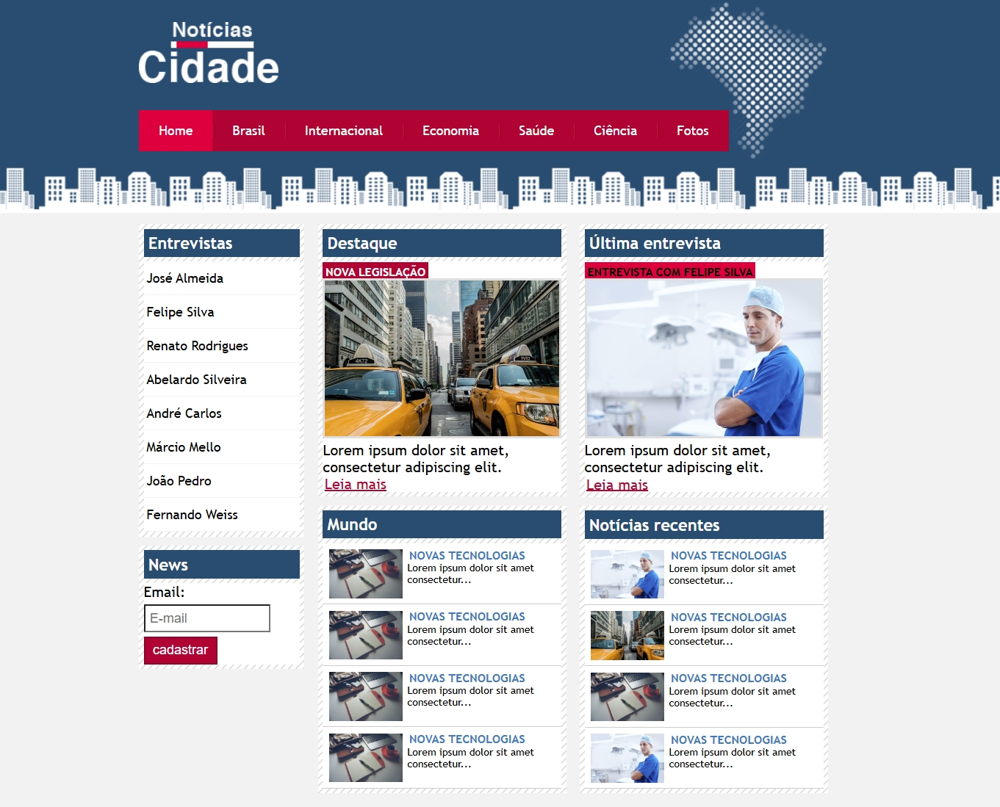

# Projeto Notícias da Cidade

---

### Descrição
---
Notícias da Cidade é um projeto de site voltado para a exibição de notícias locais, nacionais e internacionais, desenvolvido como parte de um curso focado no aperfeiçoamento de habilidades em frontend. O site apresenta uma estrutura clara e bem-organizada, permitindo que os usuários explorem categorias como Home, Brasil e Fotos.

### Tecnologias
---
- HTML5
- CSS3

### Uso
---
O projeto Notícias da Cidade foi criado para consolidar conhecimentos sobre flutuação no HTML e CSS. A propriedade float foi utilizada nas páginas index, fotos e brasil para organizar elementos, como imagens, menus e caixas de texto, de maneira alinhada e harmônica, destacando conteúdos e aprimorando o layout.

### Créditos
---
Este projeto foi desenvolvido com base no aprendizado adquirido no curso Desenvolvimento Web Completo da Udemy, ministrado pelo professor Weberson Rodrigues.

Agradecimentos ao professor pela abordagem didática e prática que tornou possível a criação deste projeto, além de incentivar o desenvolvimento de habilidades em backend.
